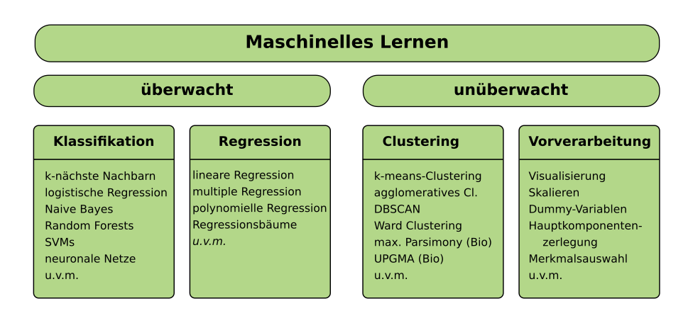

# Machine Learning mit Python

*Data Science has been called "The sexiest job of the 21st century" - probably by someone who has never visited a fire station.* (**Joel Grus**)

## Was ist Machine Learning?

**Beim Machine Learning werden mathematische und statistische Modelle computergestützt entwickelt.** Dies ist eine sehr breite Definition. Da ich nicht vorhabe, das Thema hier erschöpfend zu behandeln, reichen hier einige Anwendungsbeispiele:

* Spamfilter
* Erkennung von Postleitzahlen auf Briefen
* Empfehlung von Büchern auf Amazon
* Fotos auf Snapchat mit Katzenohren zu versehen
* automatische Übersetzung
* AlphaGo
* Roboterfußball

## Wie geht Machine Learning?

Um beim Machine Learning gut zu sein, sind drei Fähigkeiten nötig:

*Bildquelle: [Data Science Venn Diagram von Drew Conway, CC-BY-NC](http://drewconway.com/zia/2013/3/26/the-data-science-venn-diagram)*

## Was für Verfahren gibt es?

Das Feld entwickelt sich seit einigen Jahren rasant. Schneller als ich irgend etwas darüber schreiben kann. Einige Verfahren sind jedoch seit vielen Jahren Dauerbrenner. Hier ist ein grober Überblick:

* Supervised models: Linear regression, Support Vector Machines, Bayes classifiers, Neural networks.
* Other types of Machine Learning: Unsupervised learning, reinforcement learning, recurrent networks, autoencoders etc.
* Model optimization: Feature engineering, parameter optimization, metrics to evaluate model quality, dimensionality reduction, automatic model selection
* Methods for particular fields: image and video processing, speech recognition, NLP, time series analysis and forecasting
* Programming: How to write code in Python? How to handle datasets.
* Software engineering: How to test a program, deploy it and maintain it over long time?
* Distributed computing: How to process huge datasets and split computations on multiple machines or GPUs
* Communication: How to explain results in a clear and convincing way.

## Wie kann ich diese Kursmaterialien verwenden?

Mit diesen Kursmaterialien kannst Du:

* die **Codebeispiele** anschauen und ausführen
* die **Challenges** bearbeiten
* unter den **Links** mehr Lesestoff finden

Außerdem habe ich einige Grundbegriffe zum Nachschlagen beschrieben.

## Lizenz

Dieser Text ist unter den Bedingungen der Creative Commons Attribution Share Alike-Lizenz 4.0 verfügbar (CC-BY-SA-4.0).

## Kontakt

Dr. Kristian Rother (krother@academis.eu)
