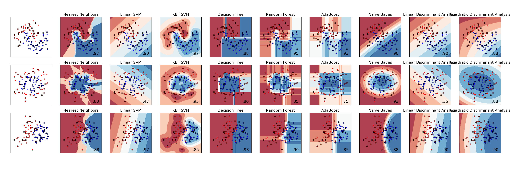
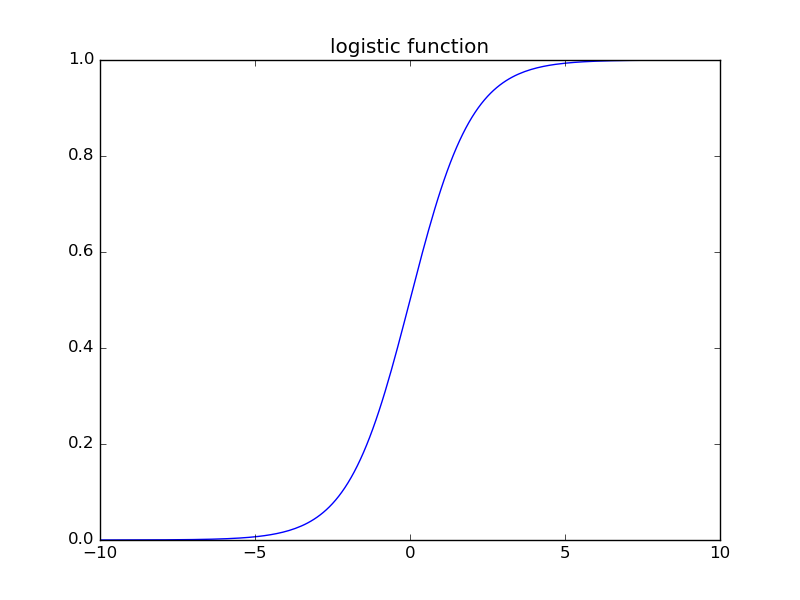

# Klassifikation

Bei der **Klassifikation** werden Datenpunkte einer fest vorgegeben Auswahl von **Kategorien** zugeordnet. Man unterscheidet **binäre Klassifikation** (*"Ist die Email Spam oder nicht?"*) und **Klassifikation mit mehreren Kategorien** (*"Welches Tier ist auf dem Bild zu sehen?"*).

Es gibt eine Unmenge an Klassifikationsverfahren, die alle ihre Vor- und Nachteile haben:

*Bildquelle: [http://scikit-learn.org/stable/auto_examples/classification/plot_classifier_comparison.html](http://scikit-learn.org/stable/auto_examples/classification/plot_classifier_comparison.html)*

Hier sind die wichtigsten kurz vorgestellt.

## Logistische Regression 
 
Bei der **logistischen Regression** verwenden wir die logistische Funktion ($y = 1 / (1 + e^x)$), um Grenzen zwischen Klassen zu ziehen. 

Im Gegensatz zur linearen Regression funktioniert die Methode der kleinsten Quadrate hier nicht. Stattdessen werden die Parameter durch Maximierung der **logarithmierten Wahrscheinlichkeit** (logit) der Funktion gefunden.

Siehe auch [Logistic Regression auf Scikit-Learn](http://scikit-learn.org/stable/modules/linear_model.html#logistic-regression)

## Support Vector Machines

Bei einer **Support Vector Machine (SVM)**, suchen wir eine **Hyperebene**, die die Daten am besten einteilt. Um nicht lineare Grenzen zu ermöglichen, werden die daten mit einem *Kernel* in einen höher dimensionalen Raum transformiert. 

Siehe auch [SVM auf Scikit-Learn](http://scikit-learn.org/stable/modules/svm.html)

## Naive Bayes

In einem Naive Bayes-Klassifikator werden die bedingten Wahrscheinlichkeiten $P(X_i|Y)$ geschätzt, indem man einfach das gemeinsame Auftreten von Merkmal $X_i$ und dem Label $Y$ in den Trainingsdaten zählt. Die Wahrscheinlichkeiten für die Vorhersage werden als Produkt aller Wahrscheinlichkeiten $P_1... P_n$ berechnet. 

Naive Bayes basiert auf der Annahme, dass alle Merkmale $X_i$ unabhängig voneinander auftreten. Dies ist eine schreckliche Vermutung! Dennoch funktioniert Naive Bayes im wirklichen Leben erstaunlich gut. Die Methode hat eine lange Erfolgsgeschichte beim Ausfiltern von Spam.

## k-Nächste-Nachbarn

Bei k-Nächste-Nachbarn wird ein Distanzkriterium verwendet, um *k* Datenpunkte in den Trainingsdaten zu finden, die dem zu klassifizierenden am nächsten liegen. Die häufigste Kategorie in diesen *k* Punkten (oder eine gewichtete Mehrheit) wird als Vorhersage verwendet.

## Entscheidungsbäume

Ein Entscheidungsbaum konstruiert einen Binärbaum, in dem jeder Knoten den Trainingsdatensatz anhand einer Frage in zwei Teilmengen teilt. Bei jeder dieser wird jeweils eine weitere Frage zur Unterscheidung gesucht usw. Entscheidungsbäume können gut mit einer Mischung aus numerischen und kategorischen Daten arbeiten. Sie sind leicht zu interpretieren und können die Daten sehr detailliert modellieren.

Wegen der letztgenanten Eigenschaft sind **Entscheidungsbäume sehr anfällig für Overfitting**.

### Random Forests

**Random Forests**, eine Ensemblemethode, lösen das Problem bei Entscheidungsbäumen etwas. Es werden mehrere Entscheidungsbäume erstellt, die sich zufallsbasiert leicht unterscheiden (zufällig ausgewählte Trainingsdaten und Merkmale). Die Vorhersage ist eine Mehrheitsentscheidung der beteiligten Bäume im Ensemble.

## Qualitätsmaße

### Konfusionsmatrix

Eine Matrix mit vier Quadranten, **Richtig Positiven (RP)**, **Richtig Negativen (RP)**, **Falsch Positiven (FP)** und **Falsch Negativen (FN)**.

### Genauigkeit

Die **Genauigkeit (Accuracy)** ist der Anteil korrekter Vorhersagen an den Vorhersagen insgesamt.

    accuracy = (RP + RN) / (RP + FP + FN + RN)

**Achtung:** Wenn der Datensatz *nicht balanciert* ist, ist die Genauigkeit kein besonders gutes Qualitätsmaß!

### Relevanz

Der Anteil Richtig Positiver an allen positiven Vorhersagen.

    relevanz = RP / (RP + FP)

### Sensitivität

Der Anteil Richtig Positiver an allen positiven Vorhersagen.

    sensitivität = RP / (RP + FN)
