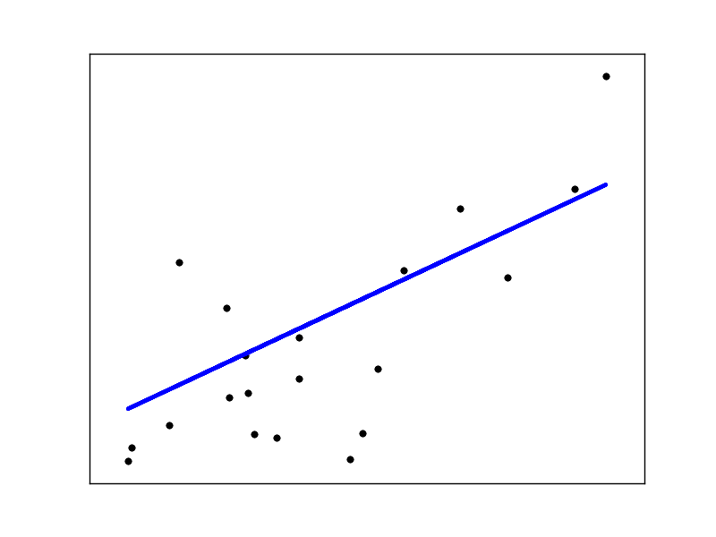

# Regression

## Lineare Regression

In der einfachsten Form passt die lineare Regression eine Gerade an x/y-Daten an. Dies geschieht durch Minimierung der quadratischen Abweichung von den y-Werten (**Least-Squares-Methode**). In der Praxis geschieht dies meistens durch ein **Gradientenverfahren**.

## Polynomielle Regression

Statt einer geraden Linie wird ein Polynom höherer Ordnung verwendet.

## Multiple Regression

Bei der multiplen Regression sind die x-Werte ein *Vektor*.
Ein Zweck der multiplen Regression ist es, **zu erklären**, welcher Faktor (oder eine Kombination von mehreren) am stärksten zu den y-Werten beiträgt.

Eine allgemeine Annahme einer multiplen Regression ist, dass die Merkmale im x-Vektor *linear unabhängig* sind. Trifft diese Annahme nicht zu, gibt es keine für das Modell keine Lösung.

## Regularisierung

Ein häufiges Problem bei linearen Modellen ist, dass die Anzahl der Parameter oft sehr groß wird. Die Ergebnisse sind daher schwer zu interpretieren und das Risiko für Overfitting wächts. Bei **Regularisierung** wird ein Strafterm addiert, um große Koeffizienten zu begrenzen.

In `scikit-learn` stehen zwei Varianten zur Verfügung: [Ridge Regression](http://scikit-learn.org/stable/modules/linear_model.html#ridge-regression) und [Lasso Regression](http://scikit-learn.org/stable/modules/linear_model.html#lasso).

## Lineare Solver

Das Python-Paket **Pulp** löst linearen Gleichungssysteme. Dazu definierst Du die Parameter des Modells, die zu optimierende lineare Kostenfunktion und eine beliebige Menge von Constraints. 

Siehe das Beispiel [Sudoku lösen](http://pythonhosted.org/PuLP/CaseStudies/a_sudoku_problem. html).

## Weitere Regressionsverfahren

Eine weitere Methode zur Regression sind **Regressionsbäume**. Schaue Die dazu den *RandomForestRegressor* näher an.

## Achtung!

Die **logistische Regression** ist ein Klassifikationsverfahren!
